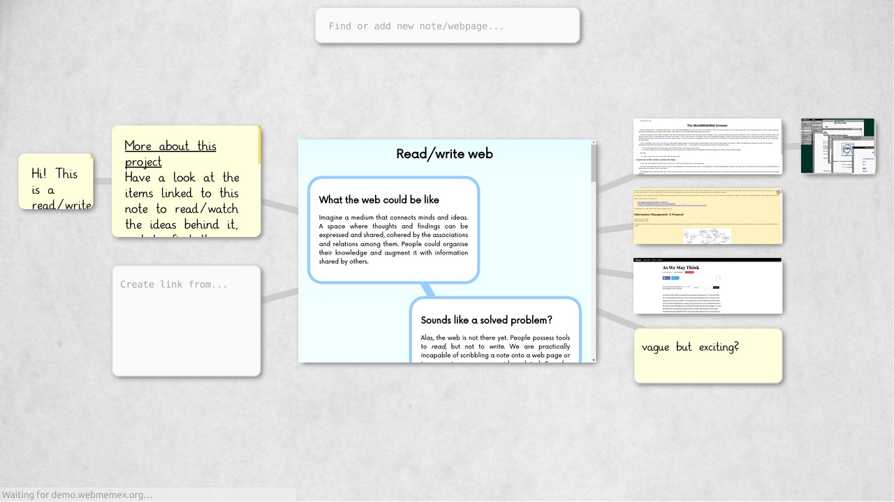

# WebMemex

A web browser that lets you save and organise the pages you visit. To create your personal web of pages and notes, connected by your assocations.

This experiment was designed to run as a web app, so effectively you run a browser inside your browser (so you can browse while you browse!).

This project is kept alive as a demo but is not developed further in this form. New forms are being worked on, see [webmemex.org](http://webmemex.org) for the current status.

## Idea

Described [here](https://rwweb.org).

## Try out

1. Open [demo.webmemex.org](http://demo.webmemex.org) in a modern browser.
2. Tell us what you think! [:email:](mailto:gerben@webmemex.org)

## Build

Building and running this demo is currently a bit of a hassle. The setup consists of two containers: this app itself, and a [`pywb-webrecorder`](https://github.com/Treora/pywb-webrecorder/tree/webmemex) instance, which is used to proxy viewed webpages while inserting some extra code into them to detect and report link clicks (because the application should open clicked links in a new iframe).

To run things yourself:

1. Get [Docker](http://docker.com) and [Node/NPM][Node].
2. Clone and run [this `pywb-webrecorder` fork](https://github.com/Treora/pywb-webrecorder/tree/webmemex) (`make rebuild start`, or something).
3. Clone and run `webmemex` (`make build run`). Then visit `localhost:8086` in your browser.

## Code tour

The whole thing is just an HTML page/app itself, using `<iframe>`s to show the browsed web pages.
[React] is used for managing the DOM, [Redux] for managing the application state, [PouchDB] for persisting data in one's local storage.
Some familiarity with Redux and its concepts (reducers, actions, store) may be required to understand the code.

The code is designed somewhat modular, and could be seen as three repos in one: _top level_ (the 'app itself'), the _canvas_ module for the UI, and the _storage_ module for handling persisted data.

### Top level app ([`src`](src))
* Sets up the app (see `main.html`, `main.jsx`): renders the canvas into the page, creates a Redux store (see `store.js`), connects the modules to the store (`reducer.js`).
* Specifies the more high level behaviour (see `actions.js`), practically meaning all the logic that involves both the UI and the storage and can thus not be put in either module.
* Its React components (`src/components/*`) specify how to display the 'documents' from the storage in the items on the canvas: the notes (`Note.jsx`), webpages (`Webpage.jsx`) and also the special empty item for navigating (`EmptyItem.jsx`).

### Canvas UI ([`src/canvas`](src/canvas))
* Implements the user interface, a 2d 'canvas' (*not* related to the html `<canvas>` element) with any amount of items and possibly with edges between them.
* Handles the placement and positioning of items (`
`s), and enables (multitouch) interactions like dragging and resizing items.
* Knows nothing of an item's content, except its `docId` given by the top level app. It simply passes this `docId` to the configured component (`StemItem` in this app), so the top level app decides what to draw inside an item.

### Storage ([`src/storage`](src/storage))
* Keeps a persistent collection of documents (currently just simple webmarks and text notes, e.g. `{url: 'https://rwweb.org'}`), and a collection links between them (simple `{sourceDocId, targetDocId}` pairs).
* Not to be confused with the Redux store (`src/store.js`), which manages the application state, and thus also contains the (non-persistent) canvas state.
* Storage is currently implemented as part of the redux store, using [`redux-pouchdb`](https://github.com/vicentedealencar/redux-pouchdb) for synchronising its state in Redux with a [PouchDB] database in the browser's offline storage.

[React]: https://facebook.github.io/react
[Redux]: http://redux.js.org
[PouchDB]: https://pouchdb.com/
[Node]: https://nodejs.org
